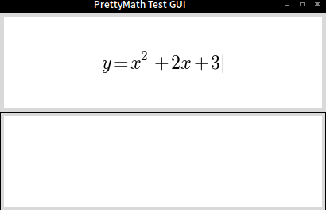
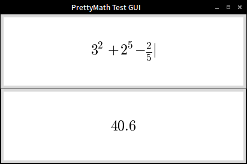

# PrettyMath
A Python library for entry and editing of math expressions that look good.

<br>



The idea of this is to handle math in a way that looks like it was written by a human.  It is much easier to read,
comprehend, and spot errors this way than in the typical way of dealing with math expressions on a computer.  Plus it
just looks a lot better and is more fun to use.

The way it works is by adding keypresses to an instance of `PrettyExpression`, which ouputs a LaTeX-formatted version to
be displayed by a matplotlib figure.  It then parses that formatted version to a Python expression, which is accessed by
the `expression` attribute of a `PrettyExpression` instance.

This project is very rough now, but has some decent functionality.  To get a feel for what it's like, run `python
calc_example.py` and play around with it.  Pressing `<Enter>` will evaluate the expression you've entered and display
the result in the lower frame.  Press `<Esc>` to clear the input area.

I plan on making a much more full-featured calculator with this library once it's functional.


# Requirements
- Python 2.7
- [matplotlib](http://matplotlib.org/) (only for calc_example.py)
- [ply](http://www.dabeaz.com/ply/)


# Installation
```
git clone git@github.com:danielhones/prettymath.git
pip install matplotlib ply
```
